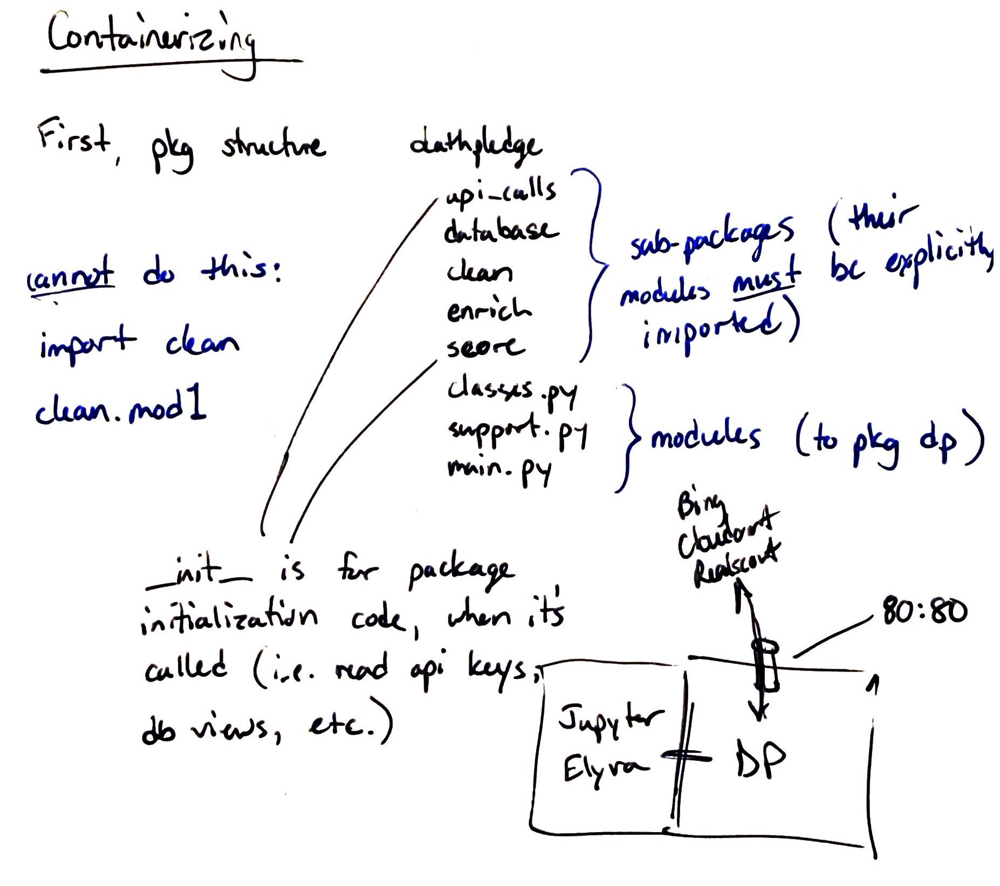

# TODO 

- [x] rename 'change_from_initial' to 'change', then 'pct_change'
- [ ] score the % change from initial price? 
- [x] move 'sold' date to before 'sale_price'
- [x] move 'sold', 'sale_price', and 'sale_diff_pct' to end of dataframe
- [x] add % diff between tax assessed value and current price
    - [ ] and score it
- [ ] metro walk score should probably be weighted a little bit higher than commute score (or at least
higher than it is now), because metro walk is applicable to everyone (not just me) and at all times (not
just early morning), and my commute will feasibly change (maybe even to a driving commute in the opposite
direction, like Belvoir or McLean) yet the metro walk will still be valuable.
- [x] price and price per sqft definitely need to be weighted higher, or else commute's weight be reduced.
See: the DC property for $550K that made it in the top 10 despite being the most expensive house I've
analyzed AND in D.C.
- [ ] score the impact/importance of local driving times: how many times per week or month do I go to each
destination (e.g., the weekly drive to volleyball is more important than the bi-monthly trip to Sam's Club)
- [ ] create visitation sheet in google with the fields that I would rate in person. Then read that sheet
in, condense it down to a single number or two, and factor it into the scorecard. It can (and often should)
be negative, as this is an adjustment of my first impression. Internal to this manual assessment is a
weighting scheme, where the neighborhood and modernity threshold should be weighted quite heavily (considering
there's not much information available to to me on those things prior to the visit). 
- [ ] get and score the availability of grocery stores and department stores. Should be weighted pretty low
(considering I can resume a normal person's grocery shopping habits I suppose). 
- [ ] add a verdict field where I can say yay or nay and overrule the total score ranking and the sold
badge (essentially it would become inactive even when not sold. _Ideally_ I would find where the ranking went
wrong, but sometimes it's as simple as I hate everything about the layout of the house, but that can't be
represented in data available to me.
    - the question then becomes: how do I deal with those no's properly? Removed from the list? Score
    reduced to zero? Or just greyed out and left out of the "active" filter view?
- [x] add JBAB to local driving (to balance out Myer and Belvoir)
- [x] consider, instead of bus walk distance (although I really like that measure), it should be the walk
distance for the first leg of the trip regardless of what the destination is. Because a few of these
listings are getting by with 0-min bus stop walks simply because the first leg of the trip isn't to a bus
stop, it's straight to the metro. However, that walk is 20-30 minutes and if that's the reality of the
daily commute (30 min walking, 5 min metro ride) then that's a bit of a problem. 

## Development notes

### ~Nov 2020 - De-bulking the process
1. No reason I can't just keep the browser open while getting listings from gsheets and looping 
through them
2. Bulk scrape, with single Selenium browser
	- but push each doc back to raw db one by one
	- the bulk upload functions I have are adding way too much complexity, get rid of them
3. After scraping, update google sheet!
4. Still with gsheet, proceed through doc IDs, pulling each one from raw and cleaning, enriching
it, scoring it.
5. New module: data sciency, pulls bulk docs w/ a view or query and applies/creates model
6. API idea: given a house, return comparable houses, stack it against the others, generate visuals
w/ that one highlighted

* Need to be scraping a lot, lot more

### 28 Nov 2020 - Next steps
* Create Cloudant views for A) all houses I've pulled and B) all _active_ houses. These are the
two groups I need to run ranking algorithms on, with more emphasis on B.
* Scoring and ranking _really_ need to be separate from processing. I can't continue to reprocess
100% of listings because it takes 30 min. Just get cleaning to a good place and then focus on 
scoring from a Cloudant view.
* In a potential web interface, plotly, bokeh, or FacetGrid, highlight a chosen house in a
visualization of _all_ houses. Univariate and bivariate charts, no more than that. 

(Sketches of two charts. The first, a bell curve with x-axis 'price' and y-axis '%', and a vertical
line just right of the median and labeled 'house XYZ'. The second, a scatterplot with a high
positive correlation and x-axis 'price' and y-axis 'sqft'; a single point is bolded and labeled 
'house XYZ'.)

* How to speed up processing? What's the bottleneck? Probably enrichment (calls to Bing), could be 
the sleep time (1 sec x 100s of listings), but I think that's necessary for my rate limits. But 
definitely take advantage of bulk gets to see if that helps. All raw docs could easily be held in
memory and doled out, just don't try to hold every home instance in memory.

### Containerizing

